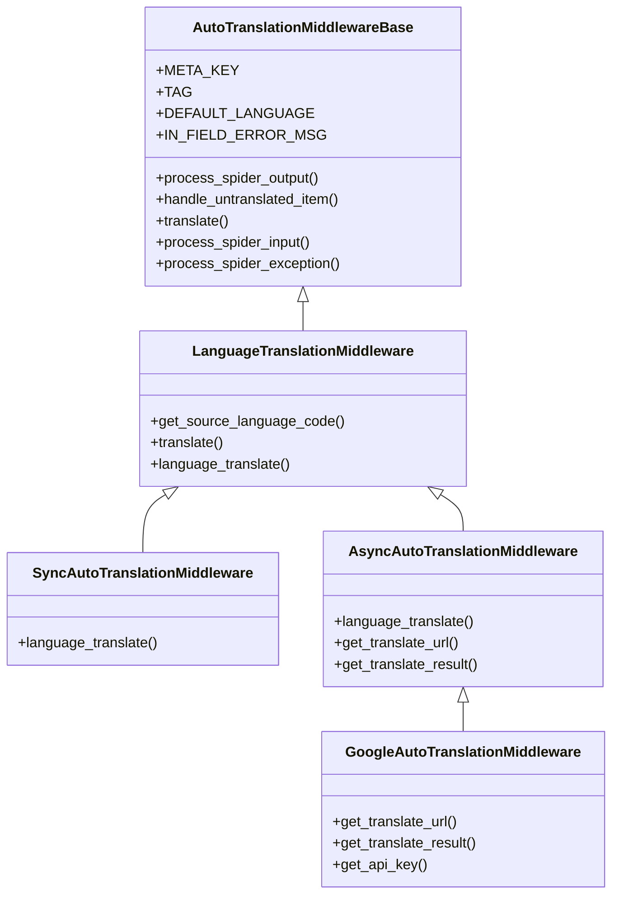

# scrapy-auto-translation-middleware

In many circumstances you may want to automatically translate an Item field into another language, and write it into another field. For example, you have defined an Item:

    class City(scrapy.Item):
	    name = scrapy.Field()
	    total_area = scrapy.Field()
	    per_capita_gdp = scrapy.Field()
	    time_zone = scrapy.Field()

The meanings are pretty straight forward. Let's assume you want the name field to be translated into some other languages, say, French, Simplfied Chinese, Japanese, by sending translation requests to Google Translation service. You obviously have an option to do this:
### Option 1:  do the translation in the spider (the worst approach)
For example, in your spider:

    from some.google.translation.lib import Translator
    Class CitySpider(scrapy.Spider):
	    name = "cities"
	    start_url = ["http://some.citydata.website",]
	    def parse(self, response, **kwargs):
		    name = response.xpath("path.to.city.name").get()
		    translator=Translator()
		    name_zh=translator.translate(name, source="en", dest="zh-CN")
This is a bad idea as you are making a synchronous request to Google when you are working in an asynchronous framework (in the case of Scrapy for specific, twisted).  A number of bad things will be resulted:
* The failure of Google Translation work will stop the entire crawling process, thus your spider will be much more vulnerable to unexpected events.
* As you are doing a synchronous work that may take unpredictable length of time, the spider will suffer from low performance (keep in mind that there's only one thread running in the Twisted framework).
* The downloader will not take care of the translation work so the states data will become inaccurate.
### Option 2: send a dedicated request to Google to finish the translation (much better, but tedious)
Consider the following:

    import scrapy
    class CitySpider(scrapy.Spider):
	    name = "cities"
	    start_url = ["http://some.citydata.website",]
	    def parse(self, response, **kwargs):
		    name = response.xpath("path.to.city.name").get()
		    yield scrapy.Request(url="google.translation.url", cb_kwargs={"name":name})
		def translate(self, response, **kwargs)
		    name = kwargs["name"]
		    name_zh=response.xpath("path.to.name_zh").get()
		    yield items.CityItem(name=name, name_zh=name_zh)
This a apparently much more in tune with Scrapy's design rules but it would be tiresome to introduce extra callback functions just for doing the  translation. Moreover, it would lower down the maintainability and readability of the code.
### Option 3: use a translation middleware (best one)
 By making use of a translation middleware you are allowed to do this in the item definition:
 
    import scrapy
    class CityItem(scrapy.Item):
	    name = scrapy.Field()
	    name_zh = scrapy.Field(auto_translate=True, source="name", language="zh")
	    name_fr = scrapy.Field(auto_translate=True, source="name", language="fr") 
	    name_ja = scrapy.Field(auto_translate=True, source="name", language="ja")
	    
In your spider, you just need to populate the original information (the field "name") and the middleware will automatically handle others that are marked as `auto_translate=True`:
     
    ......
    def parse(self, response, **kwargs):
	    ......
	    yield items.CityItem(name="city_name_crawled_from_web")
## installation
To install scrapy-auto-translation-middleware, run:

    pip install scrapy-auto-translation-middleware
## Settings
Scrapy-auto-translation-middleware provides built-in support for Google Translation. If you are happy with it, add the following code into your project's settings.py file:

    SPIDER_MIDDLEWARES = {
        scrapy_auto_trans.spidermiddlewares.autotrans.GoogleAutoTranslationMiddleware': 701
    }
Google Translation requires an API Key for each translation service request so you need to specify the key in the settings.py as well:

    GOOGLE_CLOUD_API_KEY="<api.key.you.got.from.google.cloud>"
If you don't feel comfortable to hard-code your API key in settings.py, another option is to specify the key as a command line option when you run the spider:

    scrapy crawl cities -s GOOGLE_CLOUD_API_KEY="<api.key.you.got.from.google.cloud>"
## Class hierarchy

[![](https://mermaid.ink/img/eyJjb2RlIjoiY2xhc3NEaWFncmFtXG4gIEF1dG9UcmFuc2xhdGlvbk1pZGRsZXdhcmVCYXNlIDx8LS0gTGFuZ3VhZ2VUcmFuc2xhdGlvbk1pZGRsZXdhcmVcbiAgTGFuZ3VhZ2VUcmFuc2xhdGlvbk1pZGRsZXdhcmUgPHwtLSBTeW5jQXV0b1RyYW5zbGF0aW9uTWlkZGxld2FyZVxuICBMYW5ndWFnZVRyYW5zbGF0aW9uTWlkZGxld2FyZSA8fC0tIEFzeW5jQXV0b1RyYW5zbGF0aW9uTWlkZGxld2FyZVxuICBBc3luY0F1dG9UcmFuc2xhdGlvbk1pZGRsZXdhcmU8fC0tIEdvb2dsZUF1dG9UcmFuc2xhdGlvbk1pZGRsZXdhcmVcblx0XG5cdGNsYXNzIEF1dG9UcmFuc2xhdGlvbk1pZGRsZXdhcmVCYXNle1xuICAgICtNRVRBX0tFWVxuICAgICtUQUdcbiAgICArREVGQVVMVF9MQU5HVUFHRVxuICAgICtJTl9GSUVMRF9FUlJPUl9NU0dcbiAgICBcblx0XHQrcHJvY2Vzc19zcGlkZXJfb3V0cHV0KClcblx0XHQraGFuZGxlX3VudHJhbnNsYXRlZF9pdGVtKClcbiAgICArdHJhbnNsYXRlKClcbiAgICArcHJvY2Vzc19zcGlkZXJfaW5wdXQoKVxuICAgICtwcm9jZXNzX3NwaWRlcl9leGNlcHRpb24oKVxuXHR9XG5cdGNsYXNzIExhbmd1YWdlVHJhbnNsYXRpb25NaWRkbGV3YXJle1xuICAgICtnZXRfc291cmNlX2xhbmd1YWdlX2NvZGUoKVxuICAgICt0cmFuc2xhdGUoKVxuICAgICtsYW5ndWFnZV90cmFuc2xhdGUoKVxuICB9XG4gIGNsYXNzIFN5bmNBdXRvVHJhbnNsYXRpb25NaWRkbGV3YXJle1xuICAgICtsYW5ndWFnZV90cmFuc2xhdGUoKVxuICB9XG4gIGNsYXNzIEFzeW5jQXV0b1RyYW5zbGF0aW9uTWlkZGxld2FyZXtcbiAgICArbGFuZ3VhZ2VfdHJhbnNsYXRlKClcbiAgICArZ2V0X3RyYW5zbGF0ZV91cmwoKVxuICAgICtnZXRfdHJhbnNsYXRlX3Jlc3VsdCgpXG4gIH1cbiAgY2xhc3MgR29vZ2xlQXV0b1RyYW5zbGF0aW9uTWlkZGxld2FyZXtcbiAgICArZ2V0X3RyYW5zbGF0ZV91cmwoKVxuICAgICtnZXRfdHJhbnNsYXRlX3Jlc3VsdCgpXG4gICAgK2dldF9hcGlfa2V5KClcbiAgfSIsIm1lcm1haWQiOnsidGhlbWUiOiJmb3Jlc3QifX0)](https://mermaid-js.github.io/mermaid-live-editor/#/edit/eyJjb2RlIjoiY2xhc3NEaWFncmFtXG4gIEF1dG9UcmFuc2xhdGlvbk1pZGRsZXdhcmVCYXNlIDx8LS0gTGFuZ3VhZ2VUcmFuc2xhdGlvbk1pZGRsZXdhcmVcbiAgTGFuZ3VhZ2VUcmFuc2xhdGlvbk1pZGRsZXdhcmUgPHwtLSBTeW5jQXV0b1RyYW5zbGF0aW9uTWlkZGxld2FyZVxuICBMYW5ndWFnZVRyYW5zbGF0aW9uTWlkZGxld2FyZSA8fC0tIEFzeW5jQXV0b1RyYW5zbGF0aW9uTWlkZGxld2FyZVxuICBBc3luY0F1dG9UcmFuc2xhdGlvbk1pZGRsZXdhcmU8fC0tIEdvb2dsZUF1dG9UcmFuc2xhdGlvbk1pZGRsZXdhcmVcblx0XG5cdGNsYXNzIEF1dG9UcmFuc2xhdGlvbk1pZGRsZXdhcmVCYXNle1xuICAgICtNRVRBX0tFWVxuICAgICtUQUdcbiAgICArREVGQVVMVF9MQU5HVUFHRVxuICAgICtJTl9GSUVMRF9FUlJPUl9NU0dcbiAgICBcblx0XHQrcHJvY2Vzc19zcGlkZXJfb3V0cHV0KClcblx0XHQraGFuZGxlX3VudHJhbnNsYXRlZF9pdGVtKClcbiAgICArdHJhbnNsYXRlKClcbiAgICArcHJvY2Vzc19zcGlkZXJfaW5wdXQoKVxuICAgICtwcm9jZXNzX3NwaWRlcl9leGNlcHRpb24oKVxuXHR9XG5cdGNsYXNzIExhbmd1YWdlVHJhbnNsYXRpb25NaWRkbGV3YXJle1xuICAgICtnZXRfc291cmNlX2xhbmd1YWdlX2NvZGUoKVxuICAgICt0cmFuc2xhdGUoKVxuICAgICtsYW5ndWFnZV90cmFuc2xhdGUoKVxuICB9XG4gIGNsYXNzIFN5bmNBdXRvVHJhbnNsYXRpb25NaWRkbGV3YXJle1xuICAgICtsYW5ndWFnZV90cmFuc2xhdGUoKVxuICB9XG4gIGNsYXNzIEFzeW5jQXV0b1RyYW5zbGF0aW9uTWlkZGxld2FyZXtcbiAgICArbGFuZ3VhZ2VfdHJhbnNsYXRlKClcbiAgICArZ2V0X3RyYW5zbGF0ZV91cmwoKVxuICAgICtnZXRfdHJhbnNsYXRlX3Jlc3VsdCgpXG4gIH1cbiAgY2xhc3MgR29vZ2xlQXV0b1RyYW5zbGF0aW9uTWlkZGxld2FyZXtcbiAgICArZ2V0X3RyYW5zbGF0ZV91cmwoKVxuICAgICtnZXRfdHJhbnNsYXRlX3Jlc3VsdCgpXG4gICAgK2dldF9hcGlfa2V5KClcbiAgfSIsIm1lcm1haWQiOnsidGhlbWUiOiJmb3Jlc3QifX0)
<!---
URL: [https://mermaid-js.github.io/mermaid-live-editor](https://mermaid-js.github.io/mermaid-live-editor)

-->
## Usage
The most intuitive way of using the translation middleware is to subclass `AutoTranslationMiddlewareBase` and re-write a number of methods, and specify the middleware on `settings.py` file:

    class MyTranslationMiddleware(AutoTranslationMiddlewareBase):
	    def translate(self, field_name, item, **kwargs):
		    """
		    This method is called for each field with auto_translate=True.
		    Returns either the translate result, or a (request, callback) tuple.
		    """
		def get_translate_result(self, response, field_name, item, **kwargs):
		    """
		    This method is responsible to interpret the response from the translation service website (e.g. Google Translate).
		    Returns either the translate result, or a (request, callback) tuple.
		    """
Add the following in the file `settings.py`:

    SPIDER_MIDDLEWARES = {
        scrapy_auto_trans.spidermiddlewares.autotrans.MyTranslationMiddleware': 701
    }

## Define your items
scrapy-auto-translation-middleware will be triggered if you set `auto_translation=True` in the item field definition:

    class CityItem(scrapy.Item):
        name = scrapy.Field()
        name_zh = scrapy.Field(auto_translation=True, source='name', language='zh')
You must specify **source** and **language** in the field definition. They are pretty straight forward in their meanings.
The following options are supported:
### on_failure
Use this option to specify what you want to happen if a translation fails. The default action is REPORT_IN_FIELD.
* RAISE: raise the failure and let the exception handler to handle it.
* DROP_ITEM: silently drop the item.
* REPORT_IN_FIELD: write an error message into the target field, `"--- translation error ---"` by default.
* COPY_SOURCE: copy the source into the target field.
* SET_NULL: set the target field to be None (null in json).
* SET_EMPTY: set the target field to be an empty string.

Example: 

    from scrapy_auto_trans import FailureAction
    class CityItem(scrapy.Item):
        name = scrapy.Field()
        name_zh = scrapy.Field(
	        auto_translation=True, 
	        on_failure=FailureAction.DROP_ITEM, # drop the item on translation failure,
	        language='zh', 
	        source="name",
	    )

  ### translate
  
Use this option to specify a **translator function**. If specified, it will override the middleware's `translate()` method. 
The translator function will be called when an item is being translated for a field. For example:

    def a_very_quick_translator(field_name, item, **kwargs):
	    """
	    Translator function. Returns either a translated result or a (request, callback) tuple.
	    """
	    source_field = kwargs["source"]
	    return "this is a quick translation for %s"%source_field}"
	def a_slow_translator(field_name, item, **kwargs):
    

## Write your own translation middleware

 

<!--stackedit_data:
eyJoaXN0b3J5IjpbOTE2NjU5MTcyLC0xMzU4Mzk1ODAzLC0xMT
Q3NzMxOTY3LDE2NzU5OTU4NTUsLTE0NDA1NzQwNjksLTE4NjQx
Njg3NDYsLTM1NjU4OTQzMCwtMTgyMjQzOTM1MSwtMTU5NTU2NT
M2NSwtMTY5MzAwNTkzMywtMTUwMzIyNDM5OSwyMTM2MzMzOTg1
LC01OTc3ODY0MzIsMTYwODg3MjA2MSw4MDAxMjk4NDYsLTEzND
EyOTM4OTMsLTE2NTQ4NjY1NjMsMTczOTYwNTcxNywtMTIzODE5
MTQyOSw2Njk4OTc1NF19
-->